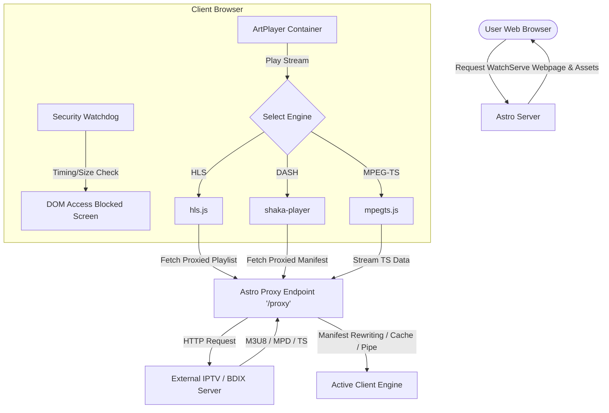

# Product Requirements Document (PRD) - Vibestream

Vibestream is a modern, high-performance, web-based Live TV and IPTV streaming platform built on Astro and designed to deliver premium HD viewing experience.

---

## 1. Executive Summary & Vision

Vibestream aims to bridge the gap between traditional IPTV playlists and standard web browsers. Standard web browsers face CORS (Cross-Origin Resource Sharing) restrictions and mixed-content blocking (HTTP streams on HTTPS sites), preventing native IPTV play. Vibestream solves this by using a hybrid server-side proxy coupled with custom frontend stream engines (HLS, DASH, and MPEG-TS) to deliver seamless, secure, and highly optimized video playback.

---

## 2. Product Features & Scope

### 2.1 Video Player Engine (ArtPlayer)
*   **Multi-Engine Playback**: Seamless integration of streaming engines:
    *   **HLS (.m3u8)**: Handled by `hls.js` with adaptive bitrate streaming (ABR) and network recovery mechanisms.
    *   **DASH (.mpd)**: Handled by Google's `shaka-player` to parse XML manifests.
    *   **MPEG-TS (.ts)**: Handled by `mpegts.js` for low-latency live streams.
*   **Autoplay Compliance**: Mute audio initially, with sound automatically enabled on first human interaction (clicks, keypresses, touches).
*   **Error Recovery Overlay**: Visual error state display explaining the issue (e.g. BDIX local network vs general stream offline) and providing a retry button.

### 2.2 Server-Side Stream Proxy (`/proxy`)
*   **CORS Bypass**: Proxies media playlists and segments to bypass cross-origin browser policies.
*   **Manifest Rewriting**:
    *   **DASH (.mpd)**: Parses the manifest to insert or correct the `<BaseURL>` tag so that subsequent segment downloads resolve properly via absolute URL paths.
    *   **HLS (.m3u8)**: Rewrites M3U8 index playlists to proxy child playlists, TS segments, encryption keys (`#EXT-X-KEY`), and initialization maps (`#EXT-X-MAP`).
*   **Short-Term Caching**: Caches manifest playlists in-memory for 2 seconds to reduce the hit rate on upstream content delivery networks (CDNs) while preserving live segment updates.
*   **Stream Piping**: Fallback pipes continuous binary data directly (MPEG-TS) to avoid loading infinite streams into server memory.

### 2.3 DRM / ClearKey Security
*   **ClearKey Decryption**: Configure DRM parameters per channel using `kid` (Key ID) and `key` values inside the JSON channel definition.
*   **Auto-Configuration**: Shaka Player automatically registers clear keys on load, facilitating immediate decryption of DRM-protected live broadcasts.

### 2.4 Navigation & Directory
*   **Responsive Dual Layout**: 
    *   **Portal Layout**: A channel search directory layout.
    *   **Player Layout**: Responsive split-screen with the video player on the left/top and a channel browser sidebar on the right/bottom.
*   **Category Navigation**: Group channels into categories (e.g. Sports, News, Entertainment) with smooth switching and horizontal scroll support.
*   **Search**: High-speed, client-side, real-time filtering of channels by name or ID.
*   **Dynamic Routing**: History API integration (`/watch/[slug]`) to update browser URLs without page reloads.

### 2.5 Security Suite (`security.js`)
*   **DevTools Blockers**: Prevents standard keyboard shortcuts (`F12`, `Ctrl+Shift+I`, `Ctrl+Shift+J`, `Ctrl+Shift+C`, `Ctrl+U`) and context menu (right-click) access.
*   **Active Console Detection**:
    *   **Debugger Timing**: Performs high-frequency timing analysis around a `debugger` statement. A pause longer than 100ms triggers access restriction.
    *   **Viewport Size Delta Check**: Inspects outer vs. inner window dimensions to detect docked developer tool pane openings.
*   **Access Denied Replacement**: Replaces the entire DOM with a premium, security warning screen, halts background intervals, and stops the media stream.

---

## 3. Tech Stack

| Layer | Technology | Rationale |
| :--- | :--- | :--- |
| **Framework** | Astro SSR (Node.js Adapter) | Fast static build, flexible server-side routing, and hybrid rendering. |
| **Routing & SSR** | Astro SSR Standalone Mode (Port 3000) | Standalone Node app to execute the server-side CORS proxy. |
| **Player Interface** | ArtPlayer | Modern UI, responsive controls, and highly customizable plugin architecture. |
| **HLS Engine** | `hls.js` | Industry standard library for browser HLS playback. |
| **DASH & DRM Engine** | `shaka-player` (v4.7.1) | Premium playback engine with ClearKey DRM support. |
| **MPEG-TS Engine** | `mpegts.js` (v1.7.3) | Enables FLV/MPEG-TS low-latency decoding over MSE. |
| **Styling** | Vanilla CSS | Low overhead, optimized performance, clean layout styles. |

---

## 4. System Architecture



---

## 5. Data Model

Channels are configured via a static JSON file (`channels.json`) which has the following schema structure:

```json
{
  "categories": {
    "category-id": {
      "name": "Category Display Name",
      "channels": [
        {
          "id": "channel-unique-id",
          "name": "Channel Name",
          "logo": "https://url-to-logo.png",
          "url": "https://stream-url.m3u8",
          "fallbackUrl": "https://fallback-stream-url.m3u8",
          "drm": {
            "kid": "hexadecimal-clear-key-id",
            "key": "hexadecimal-clear-key"
          }
        }
      ]
    }
  }
}
```

---

## 6. Non-Functional & Operational Requirements

*   **Caching Strategy**: The `/api/channels` endpoint generates a SHA-1 hash ETag of the `channels.json` data and returns HTTP 304 if data has not changed. Client and CDN caches are configured for 24 hours (`s-maxage=86400, stale-while-revalidate=604800`).
*   **Security Restrictions**: The client-side security restrictions (`security.js`) must run only in production environments (`import.meta.env.PROD`) and bypass checks on local addresses (`localhost`, `127.0.0.1`, `192.168.x.x`) to preserve the developer experience.
*   **SEO & Web Standards**:
    *   **Pre-rendering**: Dynamic routing pages (`/watch/[id]`) and portal directories utilize `export const prerender = true` to generate static paths at build time.
    *   **Structured Data**: Automatic generation of JSON-LD schemas (`BroadcastService` and `WebPage`) for search engine visibility.
    *   **Metadata**: Page title, description, and OpenGraph/Twitter card image tags customizer for each channel.
