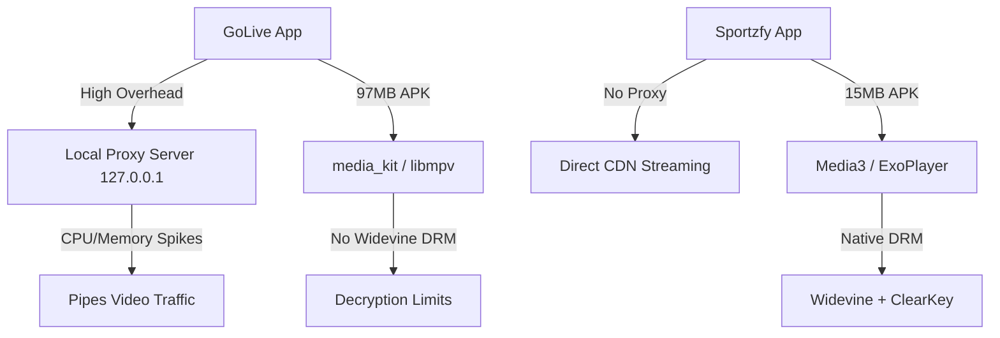
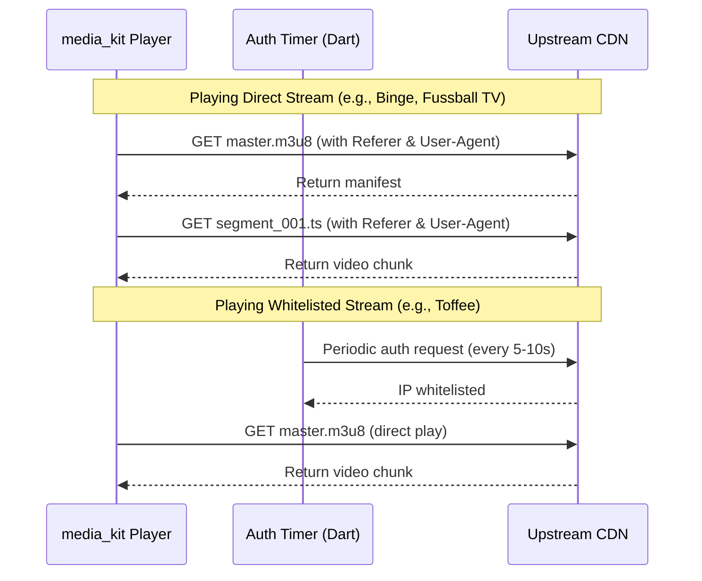

# Streaming Playback & Proxy Optimization Plan

This document analyzes the reference application **Sportzfy** (`com.blaze.sportzfy`) and provides a plan to optimize the **GoLive** Flutter app's streaming, proxy, and player architecture.

---

## 1. Analysis of Sportzfy's Streaming Architecture

By analyzing the decompiled manifest and native libraries inside `ReferanceApp_Sportzfy`, we have identified how it handles live streaming, header validation, cookies, and DRM:

### 1.1 Core Media Engine
* **Android Media3 (ExoPlayer)**: Sportzfy utilizes Google's native **Media3 / ExoPlayer** framework. We confirmed this by finding `libffmpegJNI.so` which is compiled specifically for the `androidx.media3.decoder.ffmpeg.FfmpegAudioDecoder` package.
* **JNI Helpers**: It uses a native helper library `libnative-lib.so` which registers JNI methods like `Java_com_blaze_sportzfy_utils_XUtil_Love` to decrypt stream URLs and API endpoints securely.

### 1.2 Header Propagation Mechanism
Unlike browser-based web players that struggle with CORS and sandbox limits, a native Android player handles network requests directly.
* **Direct Header Injection**: In Media3/ExoPlayer, custom headers (such as `Referer`, `User-Agent`, and `Origin`) are set directly on the `HttpDataSource.Factory` (typically `DefaultHttpDataSource.Factory`).
* **Automatic Propagation**: Once these headers are set on the player's data source factory, ExoPlayer's underlying network client automatically attaches them to **every request** generated during playback. This includes:
  1. The initial `.m3u8` or `.mpd` manifest fetch.
  2. Any variant playlist fetches (resolution switches).
  3. Every single video segment chunk request (`.ts`, `.m4s`).
  4. Decryption key requests (`#EXT-X-KEY` / `.key` files).
* **No Local Proxy Needed**: Because ExoPlayer natively propagates headers to all sub-requests, Sportzfy does not need to run an on-device local HTTP server proxy to inject headers.

### 1.3 Restricted CDNs & IP Whitelisting (WebView Integration)
For streams that require complex sessions or IP whitelisting (such as Toffee's CDN streams, which validate against a client's public IP):
* **Web activities**: The manifest defines `WebActivity` and `CustomBrowserActivity`. 
* **Dynamic Whitelisting**: Instead of passing traffic through a local proxy, the app launches a hidden or visible web session (WebView) to load the provider's entry page (e.g. `https://kkx4.livekhelatv.com/`).
* **Shared Cookie / IP Context**: 
  * Running this WebView automatically executes the required JavaScript and whitelists the device's **public IP** at the CDN level.
  * The WebView's cookies can also be retrieved via `CookieManager.getInstance().getCookie(url)` and injected directly into the player's HTTP headers.
  * Once the IP is whitelisted or cookies are retrieved, the player plays the stream **directly** from the CDN with zero proxy overhead.

---

## 2. Gaps in GoLive's Playback Architecture

When comparing GoLive's current implementation to Sportzfy, we find three main areas of inefficiency:



| Metric / Feature | GoLive (Current) | Sportzfy (Reference) | Impact on GoLive |
| :--- | :--- | :--- | :--- |
| **APK Size** | **97 MB** | **~15-20 MB** | `media_kit` bundles massive compiled `libmpv` and FFmpeg binaries for 4 architectures. |
| **Playback Flow** | Routes streams through a **local HTTP server** (`local_proxy_stub.dart`). | Direct playback from CDN with headers sent natively. | Local proxy server in Dart incurs CPU/Memory/GC overhead, causing stuttering and battery drain. |
| **DRM Support** | ClearKey only (configured via libmpv options). | ClearKey + Widevine (native Android API). | GoLive cannot play streams protected by Widevine DRM. |
| **Relative URLs** | Requires manual M3U8 string rewriting to proxy. | Handled natively by ExoPlayer. | Regex-based rewriting of manifests is prone to 404/400 errors if formatting changes. |

---

## 3. Proposed Optimization Plan

We propose a three-phase plan to optimize GoLive's streaming architecture without degrading current features:

### Phase 1: Bypass Local Proxy for Public Streams (Immediate)
We can eliminate the local proxy overhead for 90% of channels immediately by routing them directly.



1. **Verify Header Propagation**: Confirm that `media_kit` passes headers to segments using the `httpHeaders` parameter in `Media`:
   ```dart
   Media(
     channel.streamUrl,
     httpHeaders: channel.headers,
   )
   ```
2. **Remove Local Proxy Flag**: Set `proxy: false` in `channels.json` for channels like `Binge`, `Fussball TV`, and `T Sports`. These streams only need static `Referer` and `User-Agent` headers, which `media_kit` handles natively.
3. **Decouple IP Authorization**: Move Toffee/Kkx4 IP authorization out of the local proxy:
   * Start a background `Timer` inside `PlayerScreen` when a Toffee channel is selected.
   * Ping `https://kkx4.livekhelatv.com/` periodically to whitelist the device IP.
   * Play the stream directly via its CDN URL (`otte.cache.aiv-cdn.net`) with headers set in `Media`.

### Phase 2: Migrate to a Native Media3 / ExoPlayer Wrapper (Structural)
To match Sportzfy's performance, Widevine DRM support, and 15MB APK size, GoLive should transition from `media_kit` to a native Media3-backed player on Android.

1. **Evaluate Alternatives**:
   * **`better_player`**: Built on native ExoPlayer (Android) and AVPlayer (iOS). Supports custom headers, cookies, ABR, and Widevine DRM natively out of the box.
   * **Custom Platform View**: Write a minimal MethodChannel wrapper around `androidx.media3` in Android native code (`MainActivity.kt`). This offers maximum control and keeps the app lightweight.
2. **Provide Dynamic Headers**: If using `better_player` or a native view, inject headers via the player configuration:
   ```dart
   BetterPlayerDataSource dataSource = BetterPlayerDataSource(
     BetterPlayerDataSourceType.network,
     channel.streamUrl,
     headers: channel.headers,
     drmConfiguration: channel.hasDrm ? BetterPlayerDrmConfiguration(...) : null,
   );
   ```

### Phase 3: Optimize the Cloudflare Worker Proxy (Bandwidth)
For platforms/environments where a proxy is required (like bypasses or web players):
1. **Enforce `302 Redirect` for Segments**: Ensure the Cloudflare worker (`fifa-proxy-worker.js`) only proxies manifest files (`.m3u8`/`.mpd`) where URL-rewriting is necessary.
2. **Direct Media Delivery**: When a media segment (`.ts`/`.m4s`) request hits the worker, return a `302 Redirect` to the original target URL. The player will download the chunk directly from the CDN, offloading video bandwidth from Cloudflare.
