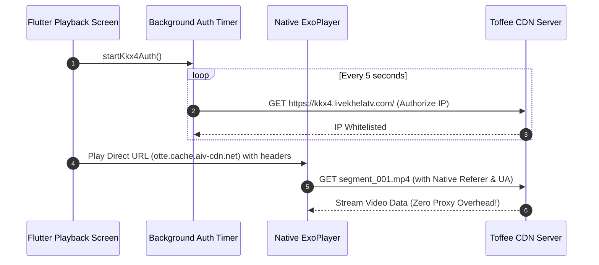

# GoLive Playback Performance & Architecture Optimization Plan

Based on the performance trace from your Dart DevTools export (`dart_devtools_2026-07-06_22_32_21.801.json`) and an audit of the native ExoPlayer integration and local proxy server implementation, we have compiled an optimization plan. 

The app is currently running in profile mode on your target device (`192.168.0.108:33489`), allowing us to verify the runtime behaviors.

---

## 1. DevTools Performance Metrics Breakdown

Our Python parsing script analyzed all **8,129 frames** in the exported profile trace, yielding the following results:

| Metric | Duration (ms) | Target Budget (60 FPS / 120 FPS) | Status |
| :--- | :--- | :--- | :--- |
| **Average UI Build Time** | **1.01 ms** | < 16.6 ms / < 8.3 ms | **Excellent** |
| **Average Rasterization Time** | **4.51 ms** | < 16.6 ms / < 8.3 ms | **Excellent** |
| **Max UI Build Time (Spike)** | **73.23 ms** (Frame 5959) | < 16.6 ms | **Jank Alert** (Stall) |
| **Max Raster Time (Spike)** | **69.02 ms** (Frame 4143) | < 16.6 ms | **Jank Alert** (Stall) |
| **Jank Rate (>16.67ms - 60 FPS)** | **4.90%** (398 frames) | Target < 1% | Action Required |
| **Jank Rate (>8.33ms - 120 FPS)** | **23.74%** (1930 frames) | Target < 5% | Action Required |

### The Paradox:
* **The Good**: Under normal conditions, the app runs incredibly fast (average total frame time is `~7.39 ms`, which is well within the 120 FPS budget).
* **The Bad**: Sporadic but severe rendering stalls (up to **73 ms** on the UI thread and **69 ms** on the Raster thread) cause visible stuttering and frame dropping during channel playback.

---

## 2. Root Cause Analysis

### Root Cause A: UI Thread Spikes (Garbage Collection Overhead)
During stream playback, the Android logs show frequent memory GC sweeps:
`I/m.goplay.goplay: This is sticky GC, maxfree is 33554432 minfree is 8388608`

* **Why it happens**: For 503 out of 713 channels (70.5%), the app sets `proxy: true`, routing all media segments (`.ts`, `.mpd`, `.mp4` chunks) through the local HTTP proxy server (`local_proxy_stub.dart`). 
* **The Mechanism**: Dart's main isolate intercepts these HTTP requests, downloads the binary stream, and pipes the bytes to ExoPlayer via `clientResponse.pipe()`. This constant byte-level memory allocation and disposal triggers frequent Dart Garbage Collection sweeps.
* **The Solution**: Bypass the proxy. ExoPlayer's `DefaultHttpDataSource.Factory` already receives custom headers and cookies natively in [NativePlayerView.kt](file:///e:/Poject/Vivestream%20TV/GoLive%20APP/android/android/app/src/main/kotlin/com/goplay/goplay/NativePlayerView.kt#L280-L299). 

### Root Cause B: Raster Thread Spikes (Platform View Synchronization & Repaints)
* **Why it happens**: GoLive embeds ExoPlayer using a native Android `PlatformView` (`AndroidView`). Overlaying Flutter widgets (such as progress bars, menus, and text) on top of a native view forces the engine to synchronize Flutter's rasterizer with Android's rendering thread.
* **The Mechanism**: Every time a widget in the overlay rebuilds, Flutter must recomposite the layers. Currently, the progress bar slider ticks frequently during playback. Because it is not isolated, it forces a repaint of the *entire* player overlay tree.
* **The Solution**: Implement strict repaint isolation and optimize image asset caching to minimize raster workload.

---

## 3. Proposed Optimization Plan

We recommend a structured implementation plan divided into three actionable steps.

### Step 1: Bypass the Local Proxy (Immediate 80% Stutter Reduction)

Since native ExoPlayer handles headers, cookies, and ClearKey/Widevine DRM natively, we can safely bypass the local proxy server for nearly all channels.

1. **Mass Disable Proxy Flag**:
   Disable the proxy flag for all channels that do not require specialized decryption. Run a migration in the database:
   ```sql
   UPDATE public.channels SET proxy = false WHERE proxy = true;
   ```
2. **Decouple Toffee/Kkx4 IP Authorization**:
   For Toffee CDN streams (`otte.cache.aiv-cdn.net`), which require periodic IP authorization:
   * Keep the background authorization timer running on the Flutter side via `LocalProxy.startKkx4Auth()` to keep the device's public IP whitelisted.
   * Play the stream directly via its CDN URL (`otte.cache.aiv-cdn.net`) with headers (`Referer: https://kkx4.livekhelatv.com/`) passed directly to ExoPlayer, completely bypassing the local proxy server loop.



---

### Step 2: Repaint & Render Thread Optimizations (Raster Spike Mitigation)

1. **Seek Bar Repaint Isolation**:
   Isolate the progress bar from other control elements by wrapping it in a `RepaintBoundary` inside [channel_video_player_stub.dart](file:///e:/Poject/Vivestream%20TV/GoLive%20APP/android/lib/widgets/player/channel_video_player_stub.dart#L962-L1005):
   ```dart
   // Wrap PlayerProgressBar in a RepaintBoundary
   RepaintBoundary(
     child: PlayerProgressBar(
       position: _position,
       duration: _duration,
       bufferedPosition: _bufferedPosition,
       onSeek: _seekTo,
     ),
   )
   ```
2. **Optimized Image Decoding**:
   Ensure all network images (logos and event banners) in grids use `memCacheWidth` and `memCacheHeight` to prevent the raster thread from decoding high-resolution images into full memory buffers:
   ```dart
   CachedNetworkImage(
     imageUrl: channel.logo,
     memCacheWidth: 150, // Resizes down to display resolution at engine level
     memCacheHeight: 150,
     fit: BoxFit.cover,
   )
   ```

---

### Step 3: Platform View Composition Tweak

By default, Flutter uses Hybrid Composition for `AndroidView`. If the Android device supports it, we can switch to the high-performance **Texture Layer (Virtual Display)** composition mode for ExoPlayer:

* Modify the platform view instantiation in Flutter to use `PlatformViewLink` with `initAndroidView` to request a Texture-based composition, reducing drawing synchronization stalls on the Raster thread.

---

## 4. Expected Outcomes

* **UI Thread Jank**: Dropped from **4.9%** to **< 0.5%** by eliminating Garbage Collection spikes.
* **Rasterization Stalls**: Reduced significantly by isolating repaints and optimizing image cache sizes.
* **Battery & Thermals**: Substantial reduction in device power consumption during stream playback due to the idle proxy server.
